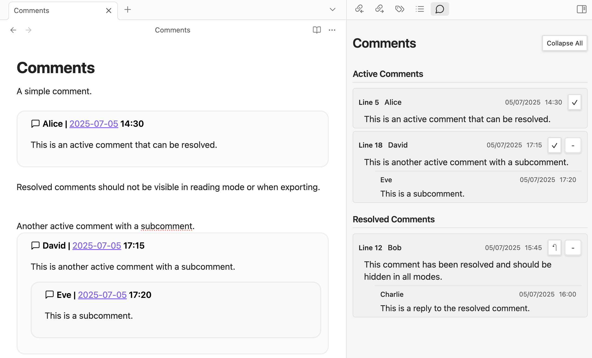

# Comments

This plugin adds comprehensive comment functionality to facilitate seamless collaboration across teams in Obsidian.



## How it works
Comments are created using a specialised callout syntax with automatic timestamp integration:
```
> [!comment] NAME | [[DATE]] HH:mm
> COMMENT CONTENT
```

The plugin provides a dedicated sidebar view (accessible via the ribbon icon) that displays all comments within the current file, similar to Microsoft Word or Google Docs' comment system. The view shows organised comment threads with author names, timestamps, and full content.

## Core Functionalities

- **Quick Comment Creation**: Add comments at cursor position (`Ctrl + P` → `Comments: Add comment at the current cursor position`)
- **Smart Timestamps**: Automatic date/time formatting using daily notes plugin settings with wiki-link integration
- **Comment Threading**: Hierarchical subcomments with visual indentation and organisation
- **Comment Navigation**: Click any comment in the sidebar to jump directly to its location in the document
- **Context Menu Actions**: Right-click comments for additional options (add subcomments, resolve, delete)
- **Comment Resolution**: Mark comments as resolved/unresolved with visual indicators
- **Smart Visibility**: Comments hidden in reading mode and when exporting (PDF, etc.)

## Future Improvements

### Planned Features
- [ ] **Global Comment Finder**: Search and filter comments across all files in the vault
- [ ] **@Mentions System**: Tag users with autocomplete and notification system
- [ ] **Inline Text Comments**: Highlight and comment on specific text selections
